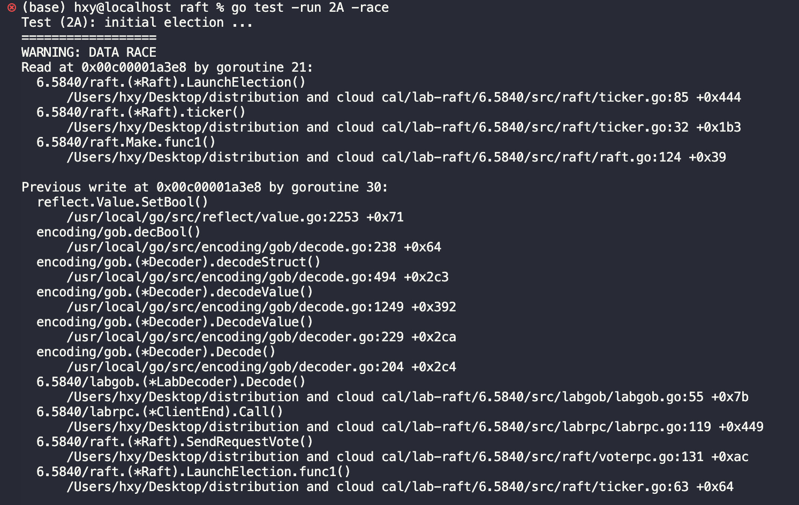
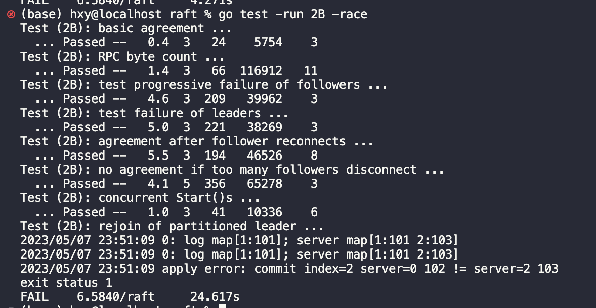
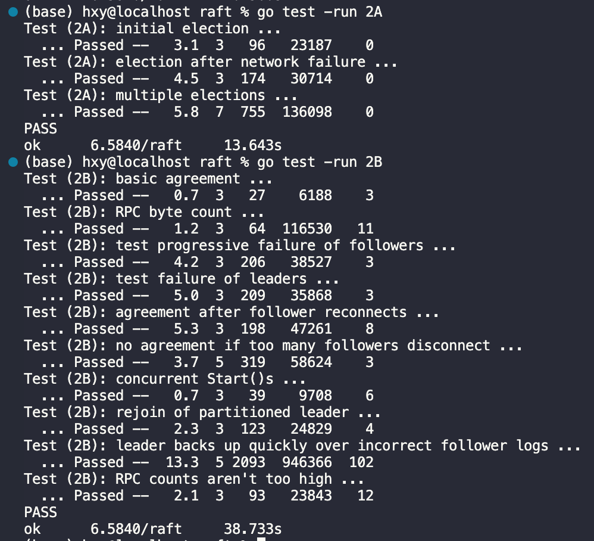

# <center>Raft实验报告</center>
##### <center>黄潇颖 2020201622</center>
报告包括使用到的**数据结构**、**2A和2B部分的实现思路**、实验中遇到的**问题和解决方案**、**实验结果**四个部分。
#### 1.数据结构
除了Raft struct中的identity和heartBeatStamp以外，其它参数都是按照论文figure2中来的。
其中，logs,nextIndex和matchIndex我选择了使用slice作为容器。
* 1.1 server structure
```go
type Raft struct {
	mu        sync.Mutex          // Lock to protect shared access to this peer's state
	peers     []*labrpc.ClientEnd // RPC end points of all peers
	persister *Persister          // Object to hold this peer's persisted state
	me        int                 // this peer's index into peers[]
	dead      int32               // set by Kill()

	// Your data here (2A, 2B, 2C).
	// Look at the paper's Figure 2 for a description of what
	applyCh chan ApplyMsg

	// state a Raft server must maintain.
	currentTerm int
	votedFor    int //candidateId that received vote in current term (or null if none)

	logs []*LogEntry

	//for all servers
	commitIndex int //index of highest log entry known to be committed (initialized to 0, increases monotonically)
	lastApplied int //index of highest log entry applied to state machine (initialized to 0, increases monotonically)

	//records of management (for leader)
	nextIndex  []int //for each server, index of the next log entry to send to that server (initialized to leader last log index + 1)
	matchIndex []int //index of highest log entry applied to state machine (initialized to 0, increases monotonically)

	//extra:
	identity       int       //0:candidate;1:follower;2:leader
	heartBeatStamp time.Time //handle timeout issue
}
```
* RequestVote RPC arguments structure
```go
type RequestVoteArgs struct {
	// Your data here (2A, 2B).
	Term         int //candidate’s term
	CandidateId  int //candidate requesting vote
	LastLogIndex int //index of candidate’s last log entry
	LastLogTerm  int //term of candidate’s last log entry
}

// RequestVote RPC reply structure.
// field names must start with capital letters!
type RequestVoteReply struct {
	// Your data here (2A).

	Term        int  //currentTerm, for candidate to update itself
	VoteGranted bool //true means candidate received vote

}
```

* Request of LogAppend RPC arguments structure
```go
type RequestLogAppendArgs struct {
	Term         int         //leader’s term
	LeaderId     int         //so follower can redirect clients
	PrevLogIndex int         //index of log entry immediately preceding new ones
	PrevLogTerm  int         //term of prevLogIndex entry
	Entries      []*LogEntry //log entries to store (empty for heartbeat;may send more than one for efficiency)
	LeaderCommit int         //leader’s commitIndex

}

// Reply of LogAppend RPC arguments structure.
type RequestLogAppendReply struct {
	Term    int
	Success bool
}
```

#### 2.实现思路
* **2.1 Vote** 
2.1.1$\space$ 在`ticker`函数中，先设置**两个重要的超时时长**:
$\space\space$ 1）**心跳超时**`HeartBeatTimeOut = 400 Millisecond`,负责监测leader是否挂机，在检测时刻距离上一次收到领导者心跳超过这个时长即leader挂掉，本server的term自增1并掉用`Raft.LaunchElection`发起新一轮选举。
$\space\space$ 2）**投票超时**`VoteTimeOut = 30 Millisecond`，在`Raft.LaunchElection`中用于candidate等待其它server给自己投票，超时返回的选票一律不统计。
$\space$ 实验给的ticker框架中已经为我们写好了检测心跳超时的循环，每两次检测间隔50-350ms的随机时间。
2.1.2$\space$ **`Raft.LaunchElection`重要实现细节**:
先声明一个变量`var voteforme uint64`来负责投票的计数，然后将选票箱并行地递给每一个server即`go Raft.BallotBox(i, &voteforme, voteargs)`。
**`Raft.BallotBox`函数**的操作：发送vote rpc，若server投票，则voteforme原子加1，否则没有动作。
给server递BallotBox后，等待一段时间(VoteTimeOut)，然后直接读取选票`ballots := int(atomic.LoadUint64(&voteforme))`并检测其是否达到半数以上，若达到了，则执行：
初始化Raft中领导者维护的变量`Raft.LeaderServerInit()`，
更新identity为leader`Raft.TransformToLeader()`，
发送心跳`go rf.StartLeaderHeartBeat(serversNum)`确保不会超时。
若未达到，则没有动作，等待下一次选举。
2.1.3 **RequestVote RPC handler的实现**:
按照论文里figure2的规则实现即可，值得说明的有两个细节。
  * 添加了一个`args.Term == rf.currentTerm`的判断区域，若是自己的信息，直接投票返回；若不是，则说明有同时发起的vote，返回false并等待下一次vote。
  * 论文中"If votedFor is null or candidateId, and candidate’s log is **at least as up-to-date** as receiver’s log, grant vote (§5.2, §5.4)"的实现：若candidate的last log term比该server的小，则不投票；若相等，则看log的长度，若candidate的不如该server的长，则不投票。(rpc_vote.go中83-86行)


* **2.2 Log Append**
按照论文里figure2的规则实现，并在此基础上添加了三个细节。
增添了一个判断区域：在args.term >= rf.currentTerm的情况下，如果发送rpc的不是自己，则需要如下操作：(rpc_logreplicate.go 72-79)
	- 转换identity为follower
	- 修改currentTerm
	- 当发送者的term和自己修改前的term相等，且自己是leader的情况时`termin == args.Term && is_leader`，说明集群出现了两个leader，则需要返回等待下一次选举。


$\space\space\space\space\space\space\space$ 余下增添的细节在下文3.3和3.4中有提到。

* **2.3 Commit & Apply**
follower的commitIndex的更新在`Raft.RequestLogAppend`中进行，主要依赖心跳来周期性对比leader发来的的commitIndex和更新。当然每一次log append也会检测，但这有滞后性，每一次log append都可能发来旧的commitIndex，若不与心跳绑定而与log append绑定会导致没有log append时follower的commitIndex得不到更新。
在server最初启动时`go rf.LogClientCheck()`，其用途：
   - 用于leader的commitIndex更新，论文中的"If there exists an N such that N > commitIndex, a majority of matchIndex[i] ≥ N, and log[N].term == currentTerm: set commitIndex = N (§5.3, §5.4)."在这里实现，没有特别的细节。
   - 所有server将新的committed log应用到状态机(apply to state machine):若`Raft.commitIndex > Raft.lastapply`，将依次为所有index大于Raft.commitIndex的log创建对应的ApplyMsg并发送到applyCh中。

#### 3.实现时遇到的问题及其思考与解决

3.1 什么时候加锁？加锁的粒度？
在做本实验时时常会遇到死锁和data race的问题，go提供的defer功能在官方来说是一个简洁美观且安全的操作，但在我看来它可能会让人偷懒然后成为死锁的罪魁祸首。加锁的粒度太大可能会影响性能，加锁的粒度太小可能会产生数据不一致。

3.2 选票统计的data race
一开始没有多写一个Raft.BallotBox函数，而是直接make了一个vote reply struct的slice，接着无论我怎么加锁都会data race。

曾经我想出了一个方案，为每一个server创建channel来进行对齐，只有`SendRequestVote`返回了才可以从vote reply struct slice中读取reply。冲突确实消失了，但是阻塞会使得它无法在限定时间内选出leader,而且选举结果很不稳定。这让我意识到在这个场景下创建指针数组是很差劲的。
最后使用了atomic包来构造Raft.BallotBox，同时解决了冲突问题和选举时间限制问题。

3.3 `Test (2B): concurrent Start()s ...`中某些log突然变短。
由于rpc的乱序到达，在log append中用下面的方法实现第3、4条规则在并发写入日志的情况下是不可靠的,可能旧的日志会把新的覆盖掉。
```go
//3. If an existing entry conflicts with a new one
//(same index but different terms),delete the
//existing entry and all that follow it
rf.logs = rf.logs[:args.PrevLogIndex+1]
//4. Append any new entries not already in the log
rf.logs = append(rf.logs, args.Entries...)
```
最终的思路为在prevIndex之后的log逐个检测，直到找到第一个conflict的log才进行覆盖，对于当前term下携带旧日志的rpc被接收之后则不会发生覆盖动作。

3.4 `Test (2B): rejoin of partitioned leader ...`中server重连之后会提交错误的log。以下图为例，经检测后发现102和103的index是相同的。

于是给log append rpc的第5条增添了对log[commint index]的term判断，当它等于current term才能commit.
```go
//5. If leaderCommit > commitIndex, set
	//commitIndex = min(leaderCommit, index of last new entry)
	if args.LeaderCommit > rf.commitIndex {
		lastlogi, _ := rf.GetLastLogInfo()
		if lastlogi >= args.LeaderCommit && rf.logs[args.LeaderCommit].Term == rf.currentTerm {
			rf.commitIndex = min(args.LeaderCommit, lastlogi)
		}

	}
```

3.5 对断联和从集群(peers)中移除的区别很模糊，打印状态之后发现断联了之后大家的peers没有减少，查看`test_test.go`和`config.go`发现断联只是让线程sleep。
曾经想靠监测rpc连接情况来判断集群中的server个数，然后用自己监测的可连接server的数值来判断是否超过半数，这样做对于vote没有影响，但是会出现commit错误log的情况。


#### 4.实验结果

